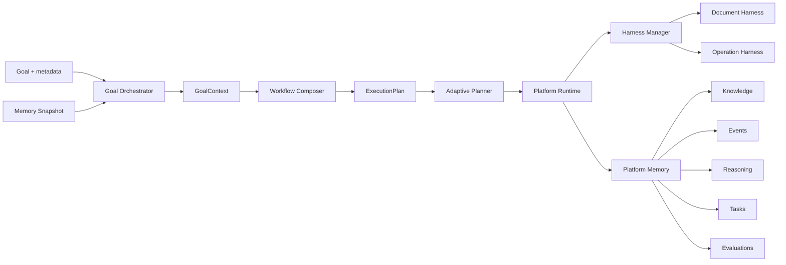

# Document AI → AI Engineering Platform

EC-SW(의료 SW) 문서 자동 작성과 **Change Impact Analysis**로 시작한 프로젝트가, **AI Engineering Platform**으로 확장 중입니다.

- **Document AI (기존):** MDSR / MDDR / XXCS 생성·갱신, 요구사항 변경 시 영향 문서만 선별 패치
- **AI Engineering Platform (확장):** Goal 기반 워크플로 오케스트레이션, 다중 Harness 실행, Platform Memory 축적

Document Harness는 첫 번째 Harness이며, Operation Harness·향후 Research/Git Harness가 같은 Runtime 위에서 동작합니다.

## 요구 사항

- Python 3.11+
- `pip install -e ".[dev]"`

## 핵심 기능

| 기능 | 설명 |
|------|------|
| **Document Harness** | EC-SW Change Impact 파이프라인 (5-agent, dry-run / apply) |
| **Operation Harness** | GPU / Docker / 로그 샘플 기반 장애 분석 (권장 조치만 반환) |
| **Goal Orchestrator** | Goal + Memory Snapshot → `ExecutionPlan` (Document / Operation / Hybrid 조합) |
| **Adaptive Planner** | Goal 파싱, Intent 분류, Memory 조회, Goal Orchestrator 위임 |
| **Platform Memory (5종)** | Knowledge, Event, Reasoning, Task, Evaluation |
| **KnowledgeGraph Change Impact** | `requirements.json` traceability → KG → 영향 문서·항목 분석 |
| **Platform CLI** | `platform-plan`, `platform-run`, `platform-ops-analyze` |

## 빠른 시작

```powershell
cd document_AI
pip install -e ".[dev]"

# 전체 테스트 (229 passed)
python -m pytest -q
```

### platform-plan — 실행 계획 미리보기

```powershell
python -m document_ai.cli platform-plan `
  --goal "Req 변경 후 GPU 서버 장애 로그 분석" `
  --case data/cases/mindrium_xa `
  --change data/cases/mindrium_xa/changes/req6_update.json `
  --sample-dir data/ops/samples
```

출력: `plan_id`, `intent`, `hybrid`, `workflow_template`, `harness_sequence`, `task_graph`, `execution_strategy`, `estimated_steps`

### platform-run — Goal Orchestrator + Runtime 실행

```powershell
python -m document_ai.cli platform-run `
  --case data/cases/mindrium_xa `
  --change data/cases/mindrium_xa/changes/req6_update.json `
  --goal "Req 변경 후 GPU 서버 장애 로그 분석" `
  --sample-dir data/ops/samples `
  --out data/platform/results/runtime_result.json
```

출력: `correlation_id`, `workflow_id`, `reasoning_id`, `evaluation_id`, `execution_plan_id`, `task_results`, `knowledge_context`, `event_refs`

### platform-ops-analyze — 운영 장애 분석 (Harness 단독)

```powershell
python -m document_ai.cli platform-ops-analyze `
  --samples data/ops/samples `
  --out data/ops/results/incident_report.json
```

## 아키텍처



**실행 흐름:** Goal → Planner → ExecutionPlan → Runtime → Harness → Memory

- **Goal Orchestrator:** Intent·Hybrid 판별, Workflow 템플릿 선택, Task Graph 생성
- **Platform Runtime:** Task Graph 순차 실행, 실패 시 downstream skip, Memory 기록
- **Platform Memory:** 실행마다 KG·Event·Reasoning·Task·Evaluation 축적 (Self-Improvement 입력)

## 데모 시나리오

### 1. Req. 6 변경 영향 분석 (Document)

```powershell
python -m document_ai.cli platform-run `
  --case data/cases/mindrium_xa `
  --change data/cases/mindrium_xa/changes/req6_update.json `
  --out data/platform/results/req6_runtime.json
```

- Document Harness만 실행 (`task-document-change-pipeline`)
- Req. 6 → IA-04 등 traceability 영향 분석 (dry-run)

### 2. Req 변경 + GPU 서버 장애 분석 (Hybrid)

```powershell
python -m document_ai.cli platform-run `
  --case data/cases/mindrium_xa `
  --change data/cases/mindrium_xa/changes/req6_update.json `
  --goal "Req 변경 후 GPU 서버 장애 로그 분석" `
  --sample-dir data/ops/samples `
  --out data/platform/results/hybrid_runtime.json
```

- Document → Operation 순서 실행 (`harness_sequence: ["document", "operation"]`)
- 요구사항 변경 영향 + GPU/Docker/로그 장애 분석을 하나의 워크플로로 연결

### 3. 샘플 로그 기반 Operation 분석

```powershell
python -m document_ai.cli platform-ops-analyze `
  --samples data/ops/samples `
  --out data/ops/results/incident_report.json
```

- `nvidia_smi`, `docker_ps`, `docker_logs`, `dmesg` 샘플 파싱
- OOM / CUDA XID / restart loop 등 이벤트 탐지 및 severity 산출

## 산출물

### CLI 출력

| 파일 | 생성 명령 | 내용 |
|------|-----------|------|
| `runtime_result.json` | `platform-run --out` | correlation_id, task_results, memory ID 참조 |
| `incident_report.json` | `platform-ops-analyze --out` | GPU/Docker/로그 장애 리포트 |

### Platform Memory (case 디렉터리, `platform-run` 실행 후)

| 경로 | Memory | 내용 |
|------|--------|------|
| `{case}/knowledge_graph.json` | Knowledge | Req·Design·Test traceability 그래프 |
| `{case}/events.jsonl` | Event | WorkflowStarted, TaskCompleted, RuntimeFailed 등 |
| `{case}/reasoning/` | Reasoning | `index.jsonl` + `{reasoning_id}.json` (추론 단계) |
| `{case}/tasks/` | Task | `index.jsonl` + `{workflow_id}.json` (태스크 상태·결과) |
| `{case}/evaluations/` | Evaluation | `index.jsonl` + `{evaluation_id}.json` (품질 메트릭) |

## Document AI (기존 CLI)

Change Impact·문서 생성 CLI는 그대로 유지됩니다.

```powershell
# 자연어 → change JSON
python -m document_ai.cli draft-change `
  --case data/cases/mindrium_xa `
  --request "Req. 6: 로그인 제한 정책 강화"

# 영향 분석
python -m document_ai.cli impact `
  --case data/cases/mindrium_xa `
  --change data/cases/mindrium_xa/changes/req6_update.json

# 영향 문서 패치
python -m document_ai.cli apply-change `
  --case data/cases/mindrium_xa `
  --change data/cases/mindrium_xa/changes/req6_update.json
```

| case | 용도 |
|------|------|
| `data/cases/mindrium_xa` | EC-SW traceability (IA↔Req), Platform 데모 |
| `data/cases/stt_srs` | IEEE SRS (FR/NFR↔TC) |
| `data/cases/jm_collection` | MDSR/MDDR 생성 예시 |

EC-SW 완성본·양식: [`data/examples/ec_sw/README.md`](data/examples/ec_sw/README.md)

## 프로젝트 구조

```
document_AI/
├── src/document_ai/
│   ├── cli.py                    # Document AI + Platform CLI
│   ├── platform/
│   │   ├── orchestration/        # Goal Orchestrator, ExecutionPlan
│   │   ├── planning/             # Adaptive Planner
│   │   ├── memory/               # Platform Memory 5종
│   │   ├── operation/            # Operation Harness
│   │   ├── runtime.py            # Platform Runtime
│   │   └── cli.py                # platform-plan / run / ops-analyze
│   ├── agents/                   # Document Harness (5-agent)
│   ├── impact/                   # Change Impact, KnowledgeGraph
│   ├── learn/                    # DOCX 추출, SRS import
│   └── render/                   # MDSR / MDDR / XXCS
├── data/
│   ├── cases/                    # 케이스 JSON + Platform Memory
│   ├── ops/samples/              # GPU/Docker/로그 샘플
│   └── templates/ec_sw/          # 빈 양식
├── docs/                         # 설계 문서
└── tests/                        # 229 tests
```

## 개발 로드맵

| 단계 | 항목 | 상태 |
|------|------|------|
| ✅ | Document Harness, Change Impact, KG | 완료 |
| ✅ | Platform Memory 5종 | 완료 |
| ✅ | Operation Harness | 완료 |
| ✅ | Adaptive Planner, Goal Orchestrator | 완료 |
| ✅ | Multi-Task Runtime, Platform CLI | 완료 |
| 🔲 | **FastAPI** — Platform REST API | 예정 |
| 🔲 | **Web Dashboard** — Workflow·Memory 시각화 | 예정 |
| 🔲 | **Research Harness** — 논문·코드 분석 | 예정 |
| 🔲 | **Git Harness** — PR·commit 연동 | 예정 |
| 🔲 | **LLM Planner** — Goal 분해·플랜 생성 | 예정 |

## Demo / Research Reports

| 문서 | 설명 |
|------|------|
| [docs/demo_document_harness_report.md](docs/demo_document_harness_report.md) | Document Harness 데모 시나리오·케이스별 점수·한계 |
| [docs/research_readiness_report.md](docs/research_readiness_report.md) | 연구 확장성·벤치마크·ablation·논문 방향 |
| [docs/gold_dataset_design.md](docs/gold_dataset_design.md) | Independent Gold Dataset 설계 |
| [docs/human_evaluation_protocol.md](docs/human_evaluation_protocol.md) | Human Evaluation Protocol |
| [docs/holdout_human_review_protocol.md](docs/holdout_human_review_protocol.md) | Holdout(`hospital_reservation`) 사람 검토·승인 |

## Holdout Human Review & Gold Approval

**Holdout case:** `hospital_reservation` (frozen — generation 규칙을 이 점수용으로 수정하지 않음)

### 1. Review package 준비 / 위치

```powershell
python -m document_ai.cli document-prepare-review --case data/cases/hospital_reservation
```

산출물: `data/review/hospital_reservation/`  
(`generated_*.docx`, `human_review_checklist.md`, `gold_fields_review.json`, `reviewer_instructions.md`, `review_result.template.json`)

### 2. Reviewer 작업

1. `reviewer_instructions.md` 읽기  
2. DOCX + checklist + `gold_fields_review.json` 검토  
3. `review_result.template.json` → **`review_result.json`** 로 저장·작성  

### 3. 요약

```powershell
python -m document_ai.cli document-review-summary --case hospital_reservation
```

→ `human_evaluation_summary.md` (평균 점수, 승인 여부, 이슈/필수수정 수)

### 4. Gold 승인 (`human_approved`) — 승인 결정 후에만

교정 DOCX를 반영했다면 먼저 `data/cases/hospital_reservation/output_*.docx`를 최종본으로 교체한 뒤:

```powershell
python -m document_ai.cli document-bootstrap-gold `
  --case data/cases/hospital_reservation `
  --split holdout `
  --approve
```

확인:

- `data/gold/case_manifest.json` 해당 case `status` = `human_approved`
- `data/gold/fields/hospital_reservation.gold_fields.json` 의 `approval_status` = `human_approved`

`--approve` 없이 bootstrap하면 `provisional`로 유지된다.

## 설계 문서

| 문서 | 설명 |
|------|------|
| [docs/ai_engineering_concept.md](docs/ai_engineering_concept.md) | WHY — AI Engineering Platform 비전·원칙 |
| [docs/platform_architecture.md](docs/platform_architecture.md) | WHAT — 컴포넌트·데이터 흐름 |
| [docs/knowledge_graph_design.md](docs/knowledge_graph_design.md) | HOW — Knowledge Graph 스키마 |
| [docs/README.md](docs/README.md) | 설계 문서 인덱스 |

## 라이선스 / 기여

SKKU Document AI 프로젝트. 이슈·PR은 저장소 정책에 따릅니다.
