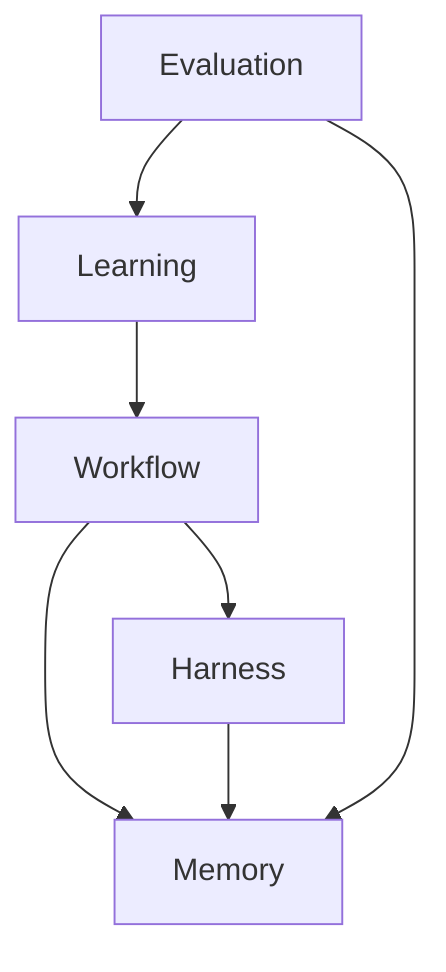

# AI Engineering Concept

> **역할:** Platform의 **WHY** — 문제 정의, 비전, 원칙, 철학  
> **다음 문서:** [Platform Architecture](platform_architecture.md) → [Knowledge Graph Design](knowledge_graph_design.md)  
> **상태:** Design (구현 전)

---

## 서문

Document AI 프로젝트는 EC-SW 문서 자동 작성과 Change Impact Analysis를 통해 **“요구사항 변경이 문서 전반에 미치는 영향”**이라는 실제 문제를 다루어 왔다. Multi-Agent Harness, Evaluation Framework, Knowledge Graph 설계까지 도달한 지금, 프로젝트는 **Document AI**에서 **AI Engineering Platform**으로 확장한다.

본 문서는 *어떻게* 구현하는가가 아니라, **왜** AI Engineering Platform이 필요한가를 설명한다. 구현 세부사항은 [Platform Architecture](platform_architecture.md)와 [Knowledge Graph Design](knowledge_graph_design.md)를 참조한다.

---

## 1. Problem Statement

### 1.1 분리된 Engineering Artifacts

현대 소프트웨어 개발에서 지식과 행위는 도메인별로 쪼개져 관리된다.

| 분리 | 증상 | 결과 |
|------|------|------|
| 요구사항 ↔ 설계 | MDSR의 Req. 6과 MDDR 설계 블록이 별도 파일·별도 담당 | 설계 누락, traceability 단절 |
| 문서 ↔ 코드 | spec은 DOCX, 구현은 Git — formal link 없음 | 문서와 코드 불일치 |
| 개발 ↔ 운영 | Dev는 feature ship, Ops는 alert 대응 | 장애 원인과 요구사항 변경의 인과 연결 실패 |
| Git / Docker / GPU / Log | 각각 별도 대시보드·별도 알림 | 성능 요구와 GPU OOM이 같은 맥락에 없음 |
| 회의 / 이메일 / Slack | 결정 사항이 문서·티켓에 반영되지 않음 | informal requirement drift |

Document AI MVP가 다룬 **Req. 6 → IA-04 → XXCS** 연결 문제는, 더 큰 분리 문제의 **축소판**이다.

### 1.2 사람 중심의 변경 영향 분석

규제 SW(EC-SW), IEEE SRS 환경에서는 요구사항 하나가 바뀔 때마다 사람이 traceability matrix를 읽고, 설계·시험·보안 문서를 수동으로 추적한다.

- 영향 범위 파악에 hours~days 소요
- 누락 시 audit finding, 재작업
- “왜 IA-04를 수정해야 하는가?”에 대한 설명 부재

Change Impact MVP는 이를 부분 자동화했지만, 운영 장애·코드 변경·회의 결정까지는 아직 범위 밖이다.

### 1.3 AI의 단일 작업 한계

Copilot, ChatGPT, 단일 LLM Agent는 **한 번에 한 프롬프트·한 번에 한 산출물**에 강하다. 그러나 Engineering Workflow는 본질적으로 다단계·다역할·다아티팩트 과정이다.

```
의도 파악 → 분해 → 조회 → 추론 → 검증 → 승인 → 실행 → 기록 → 학습
```

단일 LLM에게 “Req. 6 바꿔줘”라고 하면 traceability를 hallucinate할 수 있고, MDDR·XXCS·TC 중 어디까지 바꿔야 하는지 구조화되지 않으며, Git·deploy·GPU alert와 연결하지 않고, reasoning이 남지 않으며, 품질을 회귀 테스트하지 않는다.

### 1.4 왜 Copilot / 단일 LLM만으로는 부족한가

| 한계 | 설명 |
|------|------|
| Context window ≠ Engineering Context | 긴 문맥을 읽는 것과 Req·Design·Test·Ops가 **관계로 연결**된 것은 다르다 |
| Generative ≠ Traceable | 텍스트를 잘 생성해도 traceability edge를 보장하지 않는다 |
| Stateless chat ≠ Workflow | 대화는 흐르지만 Task Graph·승인 gate·rollback이 없다 |
| No memory layers | KG, Event log, Reasoning trace 없이는 조직 기억이 쌓이지 않는다 |
| No evaluation loop | golden set으로 반복 검증하는 구조가 없다 |
| Single agent bias | requirement·ops·reviewer 역할이 분리·검증되지 않음 |

**결론:** Engineering Automation에 필요한 것은 더 큰 LLM이 아니라, **연결된 Memory + 역할 분리된 Agent + Workflow + Evaluation**을 갖춘 **Platform**이다.

---

## 2. Vision

### 2.1 Vision Statement

> **AI Engineering Platform은 소프트웨어 개발부터 운영까지의 모든 Engineering Knowledge를 연결하고, Multi-Agent Harness를 이용하여 Engineering Workflow를 자동화하는 플랫폼이다.**

이 비전이 의미하는 바:

- **모든 Engineering Knowledge** — Req, Design, Test, Doc, Code, Git, Container, GPU, Log, Incident, Meeting, Research
- **연결** — Knowledge Graph와 Event/Reasoning Memory로 관계·시간·과정을 함께 보존
- **Multi-Agent Harness** — 역할별 Agent가 협업하고, Document / Operation / Research Harness로 묶임
- **Workflow 자동화** — Planner → Task Graph → 실행 → Review → Memory 갱신

### 2.2 궁극적 사용자 가치

**“요구사항 → 설계 → 테스트 → 문서 → 운영 → 장애 대응”**을 하나의 Platform에서 추적·설명·자동화·검증한다.

### 2.3 Document AI와의 관계

| | Document AI | AI Engineering Platform |
|---|-------------|-------------------------|
| **정체** | Platform의 Document Lifecycle MVP | 전 Engineering Lifecycle |
| **North Star** | 완성 문서 학습 → 빈 양식 자동 작성 | Engineering Knowledge 연결 → Workflow 자동화 |
| **범위** | MDSR/MDDR/XXCS, change impact | + Code, Ops, Research, Incident |
| **Agent** | 5-agent document pipeline | Document + Operation + Research Harness |
| **Memory** | case JSON files | KG + Event + Reasoning + Task + Eval Memory |

Document AI는 Platform의 **첫 번째 증명(proof)** 이다. Change Impact, Multi-Agent Harness, eval-impact는 Platform의 Workflow · Harness · Evaluation **working prototype**이다. Document AI를 대체하는 것이 아니라, **Platform 위의 Document Harness**로 흡수·확장한다.

---

## 3. Core Principles

Platform의 모든 설계·구현 결정은 아래 원칙을 따른다.

### Everything is Knowledge

Engineering에서 일어나는 모든 significant thing — Req, commit, deploy, alert, meeting note — 은 Knowledge이다. 파일, 대화, 알림, 로그를 부수적으로 두지 않고 Platform Memory에 **1급 시민**으로 등록한다.

### Everything is Traceable

모든 산출물·변경·결정은 **무엇에서 왔는지** 역추적 가능해야 한다. Req. 6 → IA-04 → XXCS row, 회의록 → change request, Git commit → FR-02 implementation.

### Everything is Explainable

자동화된 결론은 **“왜?”**에 답할 수 있어야 한다. Black-box LLM output만으로 audit·review를 통과할 수 없다. Reasoning Memory가 이 원칙의 핵심이다.

### Everything is Evaluated

“돌아간다” ≠ “맞다”. 모든 자동화 loop는 golden set, metrics, regression gate를 거친다. eval-impact는 이 원칙의 초기 구현이다.

### Everything is Connected

Req, Design, Test, Doc, Code, Ops, Research는 별개 프로젝트가 아니다. 하나의 Engineering Graph·Event stream·Workflow 위에서 연결된다.

### Human-in-the-loop

Platform은 사람을 제거하지 않는다. Review, Approval, Clarification gate를 Workflow에 내장한다. `draft-change`의 `clarifying_questions`는 이미 이 원칙을 따른다.

---

## 4. Platform Pillars

Platform은 **다섯 축(Pillars)** 위에 선다. Architecture 문서의 컴포넌트는 이 Pillars의 구현체이다.

| Pillar | 질문 | 역할 |
|--------|------|------|
| **Workflow** | 어떻게 일이 흐르는가? | intent → Task Graph → 실행 → feedback |
| **Memory** | 무엇을 기억하는가? | Engineering State persist & query |
| **Harness** | 누가 실행하는가? | domain-specific Agent ensemble |
| **Evaluation** | 맞는지 어떻게 아는가? | metrics, golden sets, regression gate |
| **Learning** | 어떻게 나아지는가? | eval·feedback → workflow·model 개선 |



---

## 5. Platform Memory

Platform Memory는 하나의 DB가 아니라, Engineering Context의 **다섯 가지 관점**이다.

| Memory | 질문 | 형태 |
|--------|------|------|
| **Knowledge Memory** | 무엇이 무엇과 연결되어 있는가? | Knowledge Graph (nodes + edges) |
| **Event Memory** | 언제 무슨 일이 일어났는가? | append-only event log |
| **Reasoning Memory** | 어떤 과정으로 그 결론에 도달했는가? | agent step trace |
| **Task Memory** | 무엇을 해야 했고, 무엇이 남았는가? | Task Graph state |
| **Evaluation Memory** | 얼마나 잘 했는가? | metrics history, golden labels |

```
Knowledge  → 세계가 어떻게 생겼는가
Event      → 세계에서 무슨 일이 일어났는가
Reasoning  → 왜 그렇게 판단했는가
Task       → 무엇을 하려 했는가
Evaluation → 잘 했는가
```

구현 매핑은 [Platform Architecture — Platform Memory](platform_architecture.md#4-platform-memory)를 참조한다.

---

## 6. Workflow

### 6.1 Workflow가 Platform 중심인 이유

Memory, Agent, KG는 **부품**이다. Engineering에서 가치를 만드는 것은 **일이 끝까지 흐르는 것**이다. Workflow Engine 없이 Memory와 Agent만 있으면 강력한 도구 모음일 뿐 Platform이 아니다.

Document AI의 `draft-change → impact → apply-change`는 **하나의 Workflow preset**이다. Platform은 Planner가 이런 preset을 동적으로 조합한다.

### 6.2 Platform Workflow 흐름

```
Planner
   ↓
Workflow Engine
   ↓
Task Graph
   ↓
Harness → Agent
   ↓
Memory (KG, Event, Reasoning, Task, Eval)
   ↓
Evaluation
   ↓
Learning
   ↓
최종 결과 + 갱신된 Platform State
```

### 6.3 Workflow vs Chat

| Chat | Workflow |
|------|----------|
| 사용자가 매번 prompt | Planner가 task decomposition |
| state in conversation | state in Task + Memory stores |
| no approval gate | Review / Approval built-in |
| no regression test | Evaluation gate |
| ends at response | ends at artifact + memory update |

---

## 7. Multi-Agent Harness

### 7.1 왜 단일 Agent가 아닌가

Engineering task는 다중 전문성·다중 검증을 요구한다. Requirement parsing ≠ traceability traversal ≠ DOCX patch ≠ ops runbook. 한 LLM이 전부 하면 스스로 검증하지 못하고 hallucination을 구조적으로 줄이기 어렵다.

Document AI의 5-agent pipeline(Requirement → Traceability → Design → Test → Review)은 **Harness 패턴의 실증**이다.

### 7.2 Harness란

**Harness = Agent ensemble + domain context + execution preset + memory hooks**

- **Agent:** 좁은 책임, structured input/output
- **Harness:** domain boundary (Document, Operation, Research)
- **Orchestrator:** Harness 간 routing, Task Graph execution

단일 Agent는 **역할**. Harness는 **팀**. Platform은 **조직**.

### 7.3 Agent 협업 (개념)

```
Planner
   ↓
Requirement → Traceability → Design → Review
   ↓                              ↓
Operation (ops context)    Research (research context)
   ↓
Memory update
```

순서는 고정 pipeline이 아니라 Planner·Task Graph가 intent에 따라 선택·재배열한다.

---

## 8. Knowledge Graph의 역할

Knowledge Graph는 Platform의 **핵심 Memory Layer**이지만, **Platform ≠ Knowledge Graph**이다.

| 없는 것 | 결과 |
|---------|------|
| Workflow | 정적 ontology, automation 없음 |
| Agent | query 가능하지만 action 없음 |
| Event / Reasoning | 구조만 있고 시간·과정 없음 |
| Evaluation | 정확한지 알 수 없음 |

### Memory · Workflow 관계

```
Knowledge Graph     ← 무엇과 연결? (structural)
        ↓
Event Store         ← 언제 무슨 일? (temporal)
        ↓
Reasoning Store     ← 왜 그렇게? (process)
        ↓
Evaluation Memory   ← 맞았나? (quality)
        ↓
Workflow            ← 다음에 무엇? (action)
```

KG는 **허브**이지만 유일한 저장소·유일한 실행 주체가 아니다. 스키마·API·구현은 [Knowledge Graph Design](knowledge_graph_design.md)를 참조한다.

---

## 9. Research Direction

| 방향 | 주제 | 현재 기반 |
|------|------|-----------|
| **Multi-Agent Engineering** | 역할 분리 Agent vs single LLM in change impact | 5-agent harness, eval-impact |
| **Knowledge Graph** | Req–Design–Test–Ops unified graph | TraceabilityGraph → Platform KG |
| **Workflow Planning** | NL intent → Task Graph | draft-change, future Planner |
| **AI Operations** | GPU alert → req–document impact | Operation Harness (planned) |
| **Research Automation** | meeting → structured artifacts | Research Harness (planned) |
| **AI Engineering Platform** | triple memory + multi-harness systems | 본 설계 전체 |

논문 시퀀스 제안은 [Platform Architecture — Research](platform_architecture.md#11-research-direction)를 참조한다.

---

## 10. Long-term Vision

```
Document AI (proof)
        ↓
AI Engineering Platform
   Workflow + Memory + Harness + Eval + Learning
        ↓
AI Engineering Operating System
   multi-tenant, audit, streaming, org-scale
        ↓
Engineering Foundation Model
   memory-informed, eval-aligned, tool-native
```

### AI Engineering Platform

Document + Operation + Research Harness, Platform Memory 5종, Planner + Workflow Engine, Unified Evaluation.

### AI Engineering Operating System

multi-project, RBAC, compliance audit trail, event streaming. Engineering action이 OS syscall처럼 Memory에 기록되고 Workflow로 실행된다.

### Engineering Foundation Model

Platform이 축적한 Memory로 학습된 Engineering prior. Model은 Planner·Agent·Eval loop **안에서** 호출되는 구성요소이며, Traceability·Eval·Human gate는 Model **밖**에 남는다.

---

## 관련 문서

| 문서 | 역할 |
|------|------|
| [Platform Architecture](platform_architecture.md) | WHAT — 컴포넌트, 다이어그램, 로드맵 |
| [Knowledge Graph Design](knowledge_graph_design.md) | HOW — KG 스키마, builder, adapter, 구현 단계 |
| [AGENTS.md](../AGENTS.md) | Document AI North Star, 현재 MVP 범위 |

---

*Version 0.1 — Design phase, no implementation*
