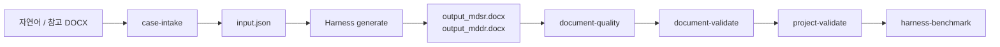

# Document Harness Demo Report

> **Historical (lab_ec_sw / JM COLLECTION)** — **Not used in Trial 1**  
> 이 문서는 과거 스프린트·벤치마크·진단 기록이다.  
> Real-world Trial 1 확정 case는 **Mindrium XA** (`trial-001-mindrium-xa`)이다.  
> Trial 1 문서: `docs/trial1_case_decision_mindrium.md`, `docs/README.md` § Trial 1


**기준일:** 2026-07-10  
**브랜치:** `feature/ai-engineering-platform` (commit `9e2d3fa`)  
**테스트:** 229 passed

Document Harness가 EC-SW(Mindrium 스타일 MDSR/MDDR) 문서를 **자연어 입력부터 품질·검증·벤치마크까지** 자동화하는 데모 결과를 정리한다.

---

## 1. 최종 사용자 시나리오

연구실 담당자 또는 품질 담당자가 다음 흐름으로 문서를 생성·검증한다.



| 단계 | CLI | 산출물 |
|------|-----|--------|
| 입력 수집 | `case-intake --text-file ... --confirm` | `input.json`, `intake_log.json` |
| 문서 생성 | `generate` (Harness 내부) | `output_mdsr.docx`, `output_mddr.docx`, 중간 JSON |
| 품질 분석 | `document-quality` | `quality_report.md` |
| Gold 비교 | `document-validate` | `validation_report.md/json` |
| 프로젝트 E2E | `project-validate` | `e2e_validation_report.json` |
| 다중 케이스 | `harness-benchmark` | `harness_benchmark_report.json/md` |

**데모 스크립트:** `scripts/demo/run_document_harness_demo.ps1` — 병원 예약 도메인 자연어 → intake → generate → quality (약 5분).

**실제 프로젝트 데모:** `data/cases/lab_ec_sw` — JM COLLECTION B2C 전자상거래, `intake_channel: real_project`.

---

## 2. 파이프라인 흐름 상세

### 2.1 자연어 Intake

- 사용자는 JSON 스키마를 몰라도 된다.
- `case-intake`가 domain, product_name, standards, free_text_hints 등을 추론해 `input.json` 초안을 만든다.
- `--confirm` 후 `confirmed: true`가 되어 Harness가 실행 가능해진다.

### 2.2 Generate

- `input.json` + 도메인별 replacement rules + (선택) 유사 케이스 retrieval로 MDSR/MDDR DOCX를 생성한다.
- 구조화 필드는 facts/rules 우선; free_text만 LLM·few-shot 후보.

### 2.3 Quality

- 6개 차원: structure, terminology, completeness, consistency, traceability, residual_text.
- 휴리스틱 기반 자동 점검. Gold 문서 불필요.

### 2.4 Validation

- Gold DOCX와 섹션·요구사항·traceability·설계 블록을 비교.
- Gold가 없는 harness dummy 케이스는 **SKIPPED**.

### 2.5 Project-validate / Benchmark

- `project-validate`: harness + quality + validation을 한 번에 실행하고 기대치와 비교.
- `harness-benchmark`: `data/eval/document_harness_benchmark.json`에 등록된 전 케이스를 일괄 실행.

**Benchmark score 정의:** validation이 있으면 `(quality_overall + validation_overall) / 2`, 없으면 `quality_overall`만 사용.

---

## 3. 케이스별 결과 비교

### 3.1 요약 표

| Case | 유형 | Quality | Validation | Benchmark | E2E Status |
|------|------|--------:|-----------:|----------:|:----------:|
| **inventory_mgmt** | harness dummy (재고) | **96.8** | SKIPPED | **96.8** | PASS |
| **hospital_reservation** | harness dummy (병원) | **95.3** | SKIPPED | **95.3** | PASS |
| **lab_ec_sw** | real EC-SW lab (JM COLLECTION) | **96.8** | **87.5** (MDSR 99.8 / MDDR 75.3) | **92.2** | PASS |
| **jm_collection** | reference authoring | **96.8** | **87.7** (MDSR 100.0 / MDDR 75.3) | **92.2** | PASS |

**Harness benchmark 전체:** 4 passed / 0 failed, **overall 94.1** (`harness-benchmark` 실행 시, 2026-07-10).

### 3.2 케이스별 해석

#### inventory_mgmt (96.8)

- 최초 harness 일반화 검증 케이스. 도메인 치환·traceability가 안정적.
- Gold 미등록 → validation 생략. benchmark = quality only.

#### hospital_reservation (95.3)

- 자연어 intake 데모 도메인. inventory 대비 terminology **90.0** (병원 도메인 용어·이커머스 잔여 표현 일부).
- residual_text **84.0** — `XX-XX-XXXX` placeholder, figure/table placeholder 잔존.
- 도메인 일반화 가능성을 보여주나, 완전 무결하지는 않음.

#### lab_ec_sw (quality 96.8, validation 87.5)

- 연구실 **실제 프로젝트** facts (`JM COLLECTION`, `ecommerce_b2c`).
- Gold: `jm_collection/output_*.docx` fallback (`project_manifest.json`).
- MDSR은 gold와 거의 일치(99.8). **MDDR 75.3** — design block coverage **5.3%**가 주요 격차.
- `project_manifest` 기대치: quality ≥ 85, validation ≥ 70 → **충족**.

#### jm_collection (reference)

- 수작업·반자동 authoring 기준선. lab_ec_sw와 유사한 validation profile (MDDR 약함).
- self-compare validation 87.7 — benchmark config의 `min_validation_overall: 95`는 현실과 불일치 (아래 한계 참고).

---

## 4. Quality 차원 상세 (공통 패턴)

| Dimension | inventory | hospital | lab_ec_sw |
|-----------|----------:|---------:|----------:|
| structure | 100.0 | 100.0 | 100.0 |
| terminology | 100.0 | 90.0 | 100.0 |
| completeness | 100.0 | 100.0 | 100.0 |
| consistency | 100.0 | 100.0 | 100.0 |
| traceability | 100.0 | 100.0 | 100.0 |
| residual_text | 84.0 | 84.0 | 84.0 |
| **overall** | **96.8** | **95.3** | **96.8** |

공통 약점: **residual_text 84.0** — 문서 번호 placeholder, 그림/표 placeholder가 아직 남아 있음.

---

## 5. force-generate vs skip-generate

### skip-generate (기본·벤치마크)

- 이미 생성된 `output_*.docx`가 있으면 harness 재생성을 건너뛴다.
- quality·validation만 재실행 → **빠르고 재현 가능**.
- 2026-07-10 벤치마크·E2E 리포트는 이 모드 기준.

### force-generate

```powershell
python -m document_ai.cli project-validate --case data/cases/lab_ec_sw --force-generate
```

**관측된 결과 (analyzer 수정 전, 동일 세션):**

| 항목 | force-generate | skip-generate (수정 후) |
|------|---------------:|------------------------:|
| harness | ok | ok |
| quality overall | **70.0 FAIL** | **96.8 PASS** |
| consistency | **0.0** | 100.0 |
| validation overall | 87.5 PASS | 87.5 PASS |
| E2E status | **FAIL** | **PASS** |

**원인:** 신규 생성 직후 quality analyzer가 `JM-web`, `JM-api`, `JM-admin` 같은 **정당한 product_code 기반 컴포넌트명**을 `mindrium_brand` 잔여로 오탐 → consistency 0 → overall 70.

**해석:**

- Validation(gold 비교)은 생성 직후에도 **87.5**로 통과 — 구조·요구사항·traceability는 유지.
- Quality 휴리스틱은 **생성 파이프라인 품질**과 **도메인 허용 규칙**에 민감하다.
- analyzer에 `product_code` 허용·`lab_ec_sw` allow_brand 반영 후 skip-generate 기준 **PASS** 확인.
- force-generate 재검증은 문서화 시점에 별도 실행하지 않았음 — 회귀 위험으로 남음.

**초기 harness-benchmark (수정 전):** 2 passed / 2 failed, overall **89.3** — lab_ec_sw quality FAIL이 원인.

---

## 6. 재현 명령어

```powershell
pip install -e ".[dev]"

# 데모 (병원 자연어)
powershell -ExecutionPolicy Bypass -File .\scripts\demo\run_document_harness_demo.ps1

# 실제 프로젝트 E2E
python -m document_ai.cli project-validate --case data/cases/lab_ec_sw
python -m document_ai.cli project-validate --case data/cases/lab_ec_sw --force-generate

# 전체 벤치마크
python -m document_ai.cli harness-benchmark

# 테스트
python -m pytest -q
```

Gold bootstrap (선택):

```powershell
powershell -ExecutionPolicy Bypass -File .\scripts\demo\bootstrap_lab_gold.ps1
```

---

## 7. 현재 한계

| 한계 | 설명 |
|------|------|
| MDDR validation 약함 | design block coverage 5.3% — 설계 서술·표 블록 gold 정합 낮음 (75.3) |
| residual placeholder | `XX-XX-XXXX`, figure/table placeholder — residual_text 84 고정 |
| Quality–Validation 불일치 | validation PASS인데 quality FAIL 가능 (force-generate 사례) |
| Gold 의존 | lab_ec_sw는 jm_collection 출력을 gold proxy로 사용 — 독립 gold 미보유 |
| XXCS 미포함 | MDSR/MDDR만 E2E; 시험결과(XXCS)·CSV bulk 미검증 |
| 도메인 치환 잔여 | hospital에서 shopping_flow 등 foreign term WARNING |
| Benchmark 리포트 덮어쓰기 | pytest 단일 케이스 테스트가 공용 `harness_benchmark_report.json`을 덮을 수 있음 — CLI 재실행 필요 |
| jm_collection 기대치 | config `min_validation_overall: 95` vs 실측 87.7 — threshold 미현실적 |

---

## 8. 다음 개선 방향

1. **MDDR design block 생성·검증** — coverage 5.3% → 구조화 설계 항목 매핑 강화.
2. **Placeholder 제거** — 문서 번호·그림 참조 자동 치환으로 residual_text 상향.
3. **Quality analyzer 도메인 화이트리스트** — product_code·component naming 규칙 일반화 (force-generate 회귀 방지).
4. **독립 gold 세트** — lab_ec_sw 전용 human-reviewed gold DOCX (jm_collection proxy 탈피).
5. **Validation threshold 정합** — benchmark config와 실측 점수 align.
6. **XXCS 확장** — document set 전체(Mindrium XA 3종) E2E.
7. **case-intake → project-validate 원클릭** — 데모 스크립트에 validation 단계 통합.

---

## 9. 산출물 위치

| 산출물 | 경로 |
|--------|------|
| 케이스 E2E | `data/cases/{case_id}/e2e_validation_report.json` |
| 품질 | `data/cases/{case_id}/quality_report.md` |
| 검증 | `data/cases/{case_id}/validation_report.md` |
| 벤치마크 | `data/eval/harness_benchmark/harness_benchmark_report.json` |
| 벤치마크 설정 | `data/eval/document_harness_benchmark.json` |
