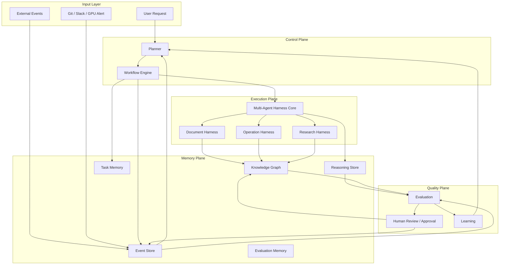
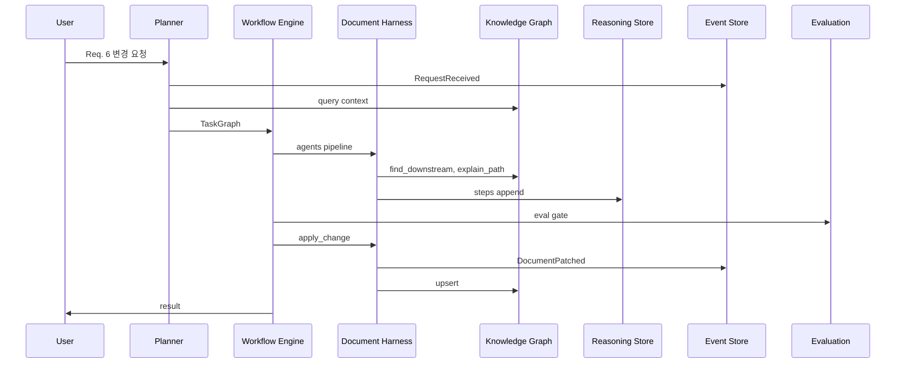
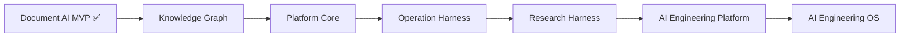

# Platform Architecture

> **역할:** Platform의 **WHAT** — 컴포넌트, 관계, 데이터 흐름, 로드맵  
> **상위 문서:** [AI Engineering Concept](ai_engineering_concept.md)  
> **하위 문서:** [Knowledge Graph Design](knowledge_graph_design.md)  
> **상태:** Design (구현 전)  
> **기준선:** `feature/ai-engineering-platform`, 55 tests passed

---

## 1. Overview

현재 저장소는 **Change Impact Analysis**, **Multi-Agent Harness**(5-agent), **Evaluation Framework**(`eval-impact`)까지 구현된 Document-centric MVP이다. 본 문서는 이를 **AI Engineering Platform**으로 확장하기 위한 컴포넌트 아키텍처를 정의한다.

### 1.1 현재 → 목표 매핑

| 현재 구현 | Platform 컴포넌트 |
|-----------|-------------------|
| `impact/orchestrator.py` | Document Harness + partial Orchestrator |
| `agents/orchestrator.py` | Multi-Agent Core + Document preset |
| `impact/graph.py` TraceabilityGraph | KG legacy adapter input |
| `eval/runner.py` | Evaluation (impact slice) |
| `intake/change_intake.py` | Requirement Agent + Planner input |
| `learn/`, `render/` | Document Harness |
| (없음) | Planner, Event Store, Reasoning Store, Operation/Research Harness |

### 1.2 하위 호환 원칙

1. `compute_impact()`, `apply_change()`, `run_change_pipeline()`, `eval-impact` **출력 스키마 불변**
2. **55 tests** Platform Stage 2까지 regression gate
3. `TraceabilityGraph` 유지 + KG adapter fallback
4. 신규 필드는 **additive only** (`provenance`, `reasoning_id`, `correlation_id`)

---

## 2. Platform Architecture

### 2.1 Component Diagram



### 2.2 Layer Summary

```
┌─────────────────────────────────────────────────────────────┐
│  Control:     Planner → Workflow Engine → Task Graph         │
├─────────────────────────────────────────────────────────────┤
│  Execution:   Multi-Agent Core → Document / Op / Research    │
├─────────────────────────────────────────────────────────────┤
│  Memory:      KG | Event | Reasoning | Task | Evaluation    │
├─────────────────────────────────────────────────────────────┤
│  Quality:     Evaluation → Review → Learning                 │
└─────────────────────────────────────────────────────────────┘
```

---

## 3. Control Plane

### 3.1 Planner

| 항목 | 내용 |
|------|------|
| **역할** | 사용자 요청·이벤트·KG 상태를 읽고 **Task Graph** 생성 |
| **입력** | natural language, change request, incident event, eval failure |
| **출력** | `TaskGraph` (tasks, dependencies, harness/agent assignment) |
| **책임** | intent 분류, task decomposition, 우선순위, human gate 삽입 |
| **비책임** | agent 실행, DOCX 패치 |

**현재 갭:** `draft-change` + 고정 pipeline만 존재. Planner는 신규.

**Intent → Task Graph 템플릿 (초안)**

| Intent | Task sequence |
|--------|---------------|
| `change_requirement` | intake → impact → design → test → review → patch → eval |
| `generate_document` | intake → retrieve → form-fill → render → review |
| `incident_response` | ingest log → KG link → impact → patch → deploy |
| `research_summary` | meeting ingest → research note → KG link |
| `gpu_alert` | alert → operation harness → incident → notify |

### 3.2 Workflow Engine

| 항목 | 내용 |
|------|------|
| **역할** | Task Graph를 순차·병렬·조건부 실행 |
| **입력** | TaskGraph, AgentContext, KG snapshot id |
| **출력** | task results, Reasoning Store entries, Event Store append |
| **책임** | dependency 해결, retry, timeout, rollback hint, harness 라우팅 |
| **비책임** | domain logic, graph 빌드 |

**현재 매핑:** `agents/orchestrator.run_change_pipeline()` → Workflow Engine의 **Document change-impact preset**.

### 3.3 Task Graph

Task Graph는 Planner 출력이며 Workflow Engine의 실행 단위이다.

| 필드 | 설명 |
|------|------|
| `task_graph_id` | 고유 ID |
| `correlation_id` | 한 사용자 요청의 event chain 연결 |
| `goal` | 자연어 목표 |
| `tasks[]` | `task_id`, `type`, `harness`, `agent`, `depends_on`, `gate`, `status` |

**Feedback loop:** Review reject → Planner revises TaskGraph → affected tasks만 재실행 → Event + Reasoning branch 기록.

---

## 4. Platform Memory

[AI Engineering Concept — Platform Memory](ai_engineering_concept.md#5-platform-memory)의 구현 매핑.

| Memory | 컴포넌트 | MVP 저장 (목표) |
|--------|----------|-----------------|
| Knowledge | Knowledge Graph | `data/cases/{id}/knowledge_graph.json` |
| Event | Event Store | `data/cases/{id}/events.jsonl` |
| Reasoning | Reasoning Store | `data/cases/{id}/reasoning/` |
| Task | Task Memory | Task Graph state (Orchestrator) |
| Evaluation | Evaluation Memory | `data/eval/results/` (기존) |

### 4.1 Event Store vs Knowledge Graph

| | Event Store | Knowledge Graph |
|---|-------------|-----------------|
| **질문** | 언제 무슨 일이 일어났는가? | 무엇이 무엇과 연결되는가? |
| **구조** | append-only log | graph (nodes + edges) |
| **변경** | immutable | mutable (upsert) |
| **예시** | `Deploy v1.2.3` at T | `Container X DEPLOYED_AS Release v1.2.3` |

**상호작용:** Event → Planner trigger → Agent 실행 → Event append + KG upsert + Reasoning append.

### 4.2 Event Types

| Event Type | Trigger | KG 영향 |
|------------|---------|---------|
| RequirementChanged | draft-change / apply-change | Requirement node, IMPACTS edges |
| DocumentGenerated | generate / generate-all | Document node |
| DocumentPatched | apply-change | Document version edge |
| GitCommit | webhook | GitCommit node |
| DockerRestart | ops webhook | LogEvent, Incident link |
| Deploy | CI/CD | Container, Server edges |
| GPUAlert | monitoring | GPU node metadata |
| Incident | alert / manual | Incident node |
| Review / Approval | human / agent | Task completion gate |
| SlackAlert | integration | external signal |
| Meeting | notes ingest | Meeting node |
| Experiment | research harness | Experiment node |

Event envelope: `event_id`, `event_type`, `timestamp`, `correlation_id`, `case_id`, `actor`, `payload`, `kg_refs`, `reasoning_ref`.

### 4.3 Reasoning Store

Multi-Agent **추론 과정** 저장. 현재 `impact_report.json`의 `pipeline[]`을 formalize한다.

| 필드 | 설명 |
|------|------|
| `reasoning_id` | 고유 ID |
| `correlation_id` | Event chain 연결 |
| `steps[]` | `agent_id`, `action`, `input`, `output`, `evidence_refs`, `duration_ms` |
| `conclusion` | legacy `impact` dict embed (contract 유지) |

**Req.6 변경 trace (예시):** requirement validate → traceability KG query → IA-04 found → design skip → XXCS patch → review ok → apply.

---

## 5. Execution Plane

### 5.1 Multi-Agent Harness Core

| 항목 | 내용 |
|------|------|
| **역할** | Agent 실행 프레임워크 |
| **현재** | `agents/base.py`, `agents/orchestrator.py` |
| **책임** | AgentContext, AgentResult, pipeline registry, prior chaining |

### 5.2 Harness 구조

| Harness | Agent preset | 산출물 | 상태 |
|---------|--------------|--------|------|
| **Document** | Requirement, Traceability, Design, Test, Security, Review | DOCX, impact_report, KG | ✅ MVP |
| **Operation** | Operation, Docker, GPU, Server, Incident | runbook, ops KG nodes | 계획 |
| **Research** | Research, Paper, Meeting, Email | research notes, citations | 계획 |

### 5.3 Agent Catalog

#### Document Domain (현재 + 확장)

| Agent | agent_id | 책임 |
|-------|----------|------|
| Requirement Agent | `requirement` | change validation, NL intake |
| Traceability Agent | `traceability` | KG query, downstream, explain_path |
| Design Agent | `design` | MDDR block impact, patch candidates |
| Test Agent | `test` | TC/XXCS impact |
| Security Agent | `security` | IA/UC/SI compliance (신규) |
| Review Agent | `document_review` | cross-artifact consistency |

#### Operation Domain (신규)

Operation, Docker, GPU, Server, Incident Agent.

#### Research Domain (신규)

Research, Paper, Meeting, Email Agent.

#### Platform Meta (신규)

Planner Agent, Eval Agent.

---

## 6. Knowledge Graph

KG는 Platform Memory의 structural layer이다. **Platform 전체가 아니라 Memory Plane의 한 컴포넌트**이다.

- 스키마, builder, query API, adapter, 구현 단계 → [Knowledge Graph Design](knowledge_graph_design.md)
- 현재 `TraceabilityGraph` (`impact/graph.py`) → adapter로 유지, 점진 migration

### Platform-level KG 엔티티 (확장)

Concept 문서의 Engineering Knowledge 전체를 담기 위한 추가 노드: SourceCode, GitCommit, Docker, GPU, Server, Log, Incident, Prompt, ModelVersion, ResearchNote, Meeting, Email, Task.

---

## 7. Evaluation & Learning

### 7.1 Evaluation

| 항목 | 내용 |
|------|------|
| **현재** | `eval/runner.py`, `eval-impact` CLI, 4 cases |
| **메트릭** | changed_req accuracy, linked security/test/design recall, clarification accuracy, FPR |
| **확장** | reasoning fidelity, MTTR (Operation), document F1 (form-fill) |

### 7.2 Learning

Eval 결과, human feedback, incident postmortem → prompt/model/workflow/graph 개선. Platform Stage 5+ 목표.

---

## 8. Data Flow

### 8.1 Change Impact Flow (현재 + 목표)



### 8.2 Memory Update Cycle

```
Workflow 실행
  → Agent: KG query
  → Reasoning: step 기록
  → Event: append
  → KG: upsert (if structural change)
  → Evaluation: metrics
  → Learning: feedback (optional)
```

---

## 9. Target Directory Layout

```
data/
├── cases/{case_id}/
│   ├── requirements.json          # existing
│   ├── knowledge_graph.json       # Stage 1
│   ├── events.jsonl               # Stage 2
│   └── reasoning/                 # Stage 2
├── eval/                          # existing + platform eval
└── projects/{project_id}/         # Stage 5

src/document_ai/
├── knowledge/                     # Stage 1
├── platform/                      # Stage 2+
│   ├── planner/
│   ├── orchestrator/
│   ├── event_store/
│   └── reasoning_store/
├── agents/                        # existing → registry
└── harness/
    ├── document/
    ├── operation/
    └── research/
```

---

## 10. Platform Roadmap



| Stage | 내용 | Deliverable |
|-------|------|-------------|
| **0 — Document AI MVP** ✅ | change impact, 5-agent, eval-impact | 55 tests |
| **1 — Knowledge Graph** | builder, query, adapter, JSON/GraphML | case-scoped KG |
| **2 — Platform Core** | Event Store, Reasoning Store, Planner v0, Workflow Engine | Task Graph + stores |
| **3 — Operation Harness** | Docker/GPU/Incident agents, ops events | cross-domain PoC |
| **4 — Research Harness** | Meeting/Email/Paper agents | research → req pipeline |
| **5 — AI Engineering Platform** | unified Planner, project KG, API, webhooks | production PoC |
| **6 — AI Engineering OS** | multi-tenant, Neo4j, streaming, RBAC | org-scale |

### KG Phase ↔ Platform Stage 매핑

| KG Design Phase | Platform Stage |
|-----------------|----------------|
| Phase 1 builder | Stage 1 |
| Phase 2 adapter | Stage 1–2 |
| Phase 3 provenance | Stage 2 (Reasoning Store) |
| Phase 4 ops nodes | Stage 3 |

---

## 11. Research Direction

| Paper | 제목 (안) | 핵심 기여 | 작성 가능 시점 |
|-------|-----------|-----------|----------------|
| **1** | Multi-Agent Harness for Traceability-Aware Change Impact Analysis | 5-agent pipeline, eval-impact benchmark | **현재** |
| **2** | Unified Knowledge Graph for AI Engineering | cross-domain schema, adapter compatibility | KG Stage 1–2 |
| **3** | Operation Harness: Req Changes to GPU Incidents | Document↔Ops cross-domain, MTTR | Stage 3 |
| **4** | AI Engineering Platform Architecture | Task Graph + triple memory + harnesses | Stage 5 |
| **5** | AI Engineering Operating System | multi-tenant, reasoning audit, self-eval | Stage 6 |

---

## 관련 문서

| 문서 | 역할 |
|------|------|
| [AI Engineering Concept](ai_engineering_concept.md) | WHY — 문제, 비전, 원칙 |
| [Knowledge Graph Design](knowledge_graph_design.md) | HOW — KG 스키마, API, 구현 |
| [AGENTS.md](../AGENTS.md) | Document AI MVP, 스킬 맵 |

---

*Version 0.1 — Design phase, no implementation*
